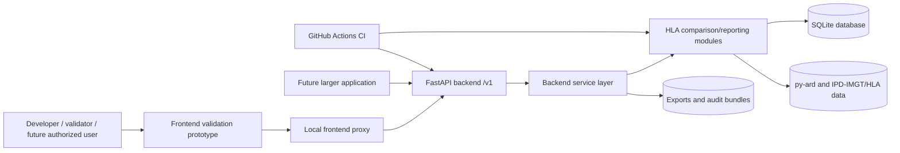

# Проект На Software Architecture

Статус: Draft за планиране на клинична готовност. Не е одобрен за клинична употреба.

Този документ описва текущата software architecture на HLA Transplantation
Simulation проекта и началната архитектурна рамка за използване като backend
компонент в по-голямо приложение. Документът не е baselined design record и не
разрешава клинична употреба.

## Цел

Целта на architecture draft-а е да свърже requirements, risks, current
implementation, interfaces, trust boundaries, failure modes и бъдещи
verification/validation needs. Той създава начални `ARCH-*` identifiers, които
могат да бъдат използвани в traceability matrix и verification plan.

## Изходни Документи

Вътрешни source документи:

- [Български Clinical Readiness Обзор](bg-readiness-overview.md)
- [Intended Use](intended-use.md)
- [Risk Management And Initial Risk Register](risk-register.md)
- [Software Requirements Specification Draft](software-requirements.md)
- [Traceability Matrix Draft](traceability-matrix.md)
- [Frontend Prototype Draft](frontend-prototype.md)
- [Backend API Component](../backend.md)
- [Backend Integration Guide](../backend-integration.md)
- [Data Policy](../data.md)
- [Cybersecurity Plan Draft](cybersecurity-plan.md)
- [Data Governance Plan Draft](data-governance.md)
- [SOUP And Dependency Register Draft](soup-dependency-register.md)

Официални външни references, проверени на 2026-08-26:

- IEC 62304:2006, Medical device software - software life cycle processes:
  https://committee.iso.org/standard/38421.html
- ISO 14971:2019, Medical devices - application of risk management:
  https://www.iso.org/standard/72704.html
- IEC 62366-1:2015, Medical devices - usability engineering:
  https://webstore.iec.ch/en/publication/21863
- European Commission MDCG guidance index for MDR/IVDR:
  https://health.ec.europa.eu/medical-devices-sector/new-regulations/guidance-mdcg-endorsed-documents-and-other-guidance_en

## Архитектурен Обхват

Текущият обхват е неклиничен:

- CLI за HLA data management, comparison, reporting и audit operations;
- FastAPI backend API компонент с versioned `/v1` endpoints;
- static frontend validation prototype с local proxy;
- SQLite persistence;
- deterministic exports и audit bundles;
- automated tests и GitHub Actions CI.

Извън текущия обхват:

- clinical decision support;
- donor acceptance/rejection или allocation;
- DSA/MFI/cPRA/eplet/PIRCHE interpretation;
- role-based clinical sign-off;
- production clinical deployment;
- LIS/EHR/FHIR/HL7 integration;
- identifiable clinical data processing.

## System Context

## Component Inventory

| ID | Component | Current files | Responsibility | Current status |
| --- | --- | --- | --- | --- |
| ARCH-001 | CLI entry layer | `main.py`, `cli.py`, `command_cli.py` | Command routing, legacy compatibility, user-visible CLI behavior | Present |
| ARCH-002 | Backend API layer | `backend_app.py` | FastAPI app, versioned endpoints, request IDs, structured errors, API-key gate | Present |
| ARCH-003 | Backend service layer | `backend_services.py`, `backend_config.py` | Settings, response envelopes, readiness, report/comparison/audit orchestration | Present |
| ARCH-004 | HLA validation and reduction | `hla_validation.py`, `hla_reduction.py`, `config.py` | Allele validation and CANONICAL/LGX/G/P reduction support | Present |
| ARCH-005 | Deterministic comparison engine | `hla_comparison.py`, `hla_matrix.py`, `mismatch_summary.py`, `comparison_statistics.py` | Copy-sensitive comparison, matrix, summary and statistics views | Present |
| ARCH-006 | Persistence layer | `database.py`, `migrations.py`, `subjects.py`, `typings.py`, `analyses.py`, `batch_history.py` | SQLite schema, migrations, subject/typing/analysis/batch persistence | Present |
| ARCH-007 | Batch workflow layer | `batch_analysis.py`, `batch_ranking.py`, `batch_selection.py`, `batch_exporters.py` | One-to-many execution, software ordering, selection and export | Present |
| ARCH-008 | Reporting layer | `step27_reporting.py`, `step28_report_comparison.py`, `exporters.py`, `html_reports.py` | STEP 27 reports, STEP 28 comparisons, JSON/CSV/HTML/text exports | Present |
| ARCH-009 | Audit bundle layer | `audit_bundle.py` | Reproducible audit bundle creation with report/comparison/doctor/schema/metadata artifacts | Present |
| ARCH-010 | Frontend validation prototype | `frontend/index.html`, `frontend/styles.css`, `frontend/app.js` | Bulgarian local validation UI for reports, comparisons, audit and raw JSON review | Prototype |
| ARCH-011 | Frontend local proxy | `frontend/serve.py` | Static serving and `/api/*` proxy to backend `/v1` | Prototype |
| ARCH-012 | Test and CI controls | `tests/`, `.github/workflows/ci.yml` | Automated verification foundation for CLI, backend, persistence, reports and exports | Present |
| ARCH-013 | Runtime packaging | `pyproject.toml`, `requirements*.txt`, `Dockerfile`, `.dockerignore` | Dependency declarations, console scripts and backend container packaging | Present |
| ARCH-014 | Future larger application boundary | external to this repository | Authenticated UI, RBAC, clinical workflow, deployment controls and integrations | Planned |
| ARCH-015 | Future integration adapters | external or future modules | LIS/EHR/FHIR/HL7 data exchange and source-system provenance | Planned |

## Interface Inventory

| ID | Interface | Producer | Consumer | Data/control crossing |
| --- | --- | --- | --- | --- |
| IF-001 | CLI commands | `main.py` / `command_cli.py` | Local operator/developer | HLA subject, typing, report, comparison, audit operations |
| IF-002 | HTTP `/v1` API | `backend_app.py` | Frontend prototype and future larger app | JSON request/response contracts and request IDs |
| IF-003 | SQLite connection | persistence modules | domain/service modules | Subjects, typings, analyses, batch history and migrations |
| IF-004 | Filesystem exports | reporting/audit modules | developer/validator | JSON, CSV, HTML, text and audit bundle artifacts |
| IF-005 | py-ard/IPD-IMGT/HLA data | local `pyard-data/` and py-ard | validation/reduction modules | Allele validation and representation reduction support |
| IF-006 | Environment configuration | `backend.env` / environment | backend runtime | database path, export path, API key, host, port, CORS and log level |
| IF-007 | Frontend local proxy | `frontend/serve.py` | browser frontend | same-origin `/api/*` forwarding to `/v1` |
| IF-008 | CI workflow | GitHub Actions | repository maintainers | tests, compilation, package build and smoke checks |
| IF-009 | Future clinical app integration | future larger app | backend `/v1` | authenticated requests with clinical workflow controls outside this component |

## Основни Data Flows

### DF-001 CLI Report Flow

1. Потребителят стартира CLI command, например `report recipient RECIP-001`.
2. CLI layer валидира routing и options.
3. Persistence layer зарежда subject/typing/batch data.
4. HLA validation/reduction и comparison/reporting layers изграждат deterministic software artifact.
5. Output се показва в CLI или се записва като JSON/CSV/HTML/text export.

### DF-002 Backend Live Report Flow

1. Frontend prototype или future app изпраща `POST /v1/reports/live`.
2. Backend API layer добавя/echo-ва `X-Request-ID`.
3. Service layer изгражда `clinical: false` envelope.
4. Reporting layer връща STEP 27 report data.
5. Frontend показва таблици, locus summary и raw JSON без clinical decision fields.

### DF-003 Level Comparison Flow

1. Client изпраща `POST /v1/comparisons/levels` с direction, external ID и selected levels.
2. Service layer извиква STEP 28 comparison logic.
3. Output включва level rows, pair delta rows, locus delta rows и metadata.
4. UI показва differences като deterministic software comparison, не като suitability.

### DF-004 Audit Bundle Flow

1. Client или CLI стартира audit operation.
2. Audit layer създава report, comparison, doctor output, schema status и metadata.
3. Filesystem export path се използва за audit artifacts.
4. Bundle metadata остава reproducibility artifact, не clinical sign-off.

### DF-005 Frontend Validation Flow

1. Browser зарежда static UI от `frontend/serve.py`.
2. Browser calls отиват към `/api/*`.
3. Local proxy forwarding пренасочва към backend `/v1`.
4. Browser визуализира JSON response и status messages на български.

### DF-006 Future Clinical Integration Flow

Този flow е planned, не implemented:

1. Larger application authenticates user and enforces RBAC.
2. Larger application calls backend `/v1` only as analytics/reporting component.
3. Clinical workflow, sign-off, training, audit trail, retention and governance
   remain responsibility of the larger application and QMS.
4. Backend output cannot trigger automated clinical action.

## Trust Boundaries

| Boundary | Current control | Gap before clinical use |
| --- | --- | --- |
| Browser to local proxy | Same-origin local proxy; validation prototype only | Production frontend security model missing |
| Proxy to backend API | Local HTTP and optional `X-API-Key` | TLS/gateway/RBAC missing |
| Backend to SQLite | Local configured database path | Production database controls, backup/restore and access review missing |
| Backend to filesystem exports | Configured export directory; ignored from Git | Retention, access control and audit review missing |
| Code to py-ard/IPD-IMGT/HLA data | Local dependency, doctor checks and draft SOUP/dependency register | Controlled source-data provenance, checksum and update review missing |
| Repository to runtime secrets/data | `.gitignore`, examples without secrets, draft cybersecurity/data-governance plans | Formal PHI/secrets scan, retention and governance approval missing |
| Backend to future clinical workflow | Non-clinical envelope and no decision fields | Integration contract and validation missing |

## Safety Architecture Decisions

| ID | Decision | Linked requirements | Linked risks |
| --- | --- | --- | --- |
| SAD-001 | Current architecture returns software artifacts only and includes `clinical: false` envelopes. | CLM-001, API-002 | RM-009, RM-018, RM-023 |
| SAD-002 | Backend API is versioned under `/v1`; legacy endpoints are hidden from OpenAPI. | API-001 | RM-009, RM-012, RM-017 |
| SAD-003 | Readiness and liveness probes are separated from clinical availability claims. | API-004, UI-002, OPS-002 | RM-012, RM-016, RM-024 |
| SAD-004 | Frontend approval control is disabled and no clinical sign-off is stored. | CLM-004, UI-006 | RM-010, RM-023 |
| SAD-005 | Audit bundles are reproducibility evidence, not release or clinical approval records. | FUNC-003, AUD-001 | RM-008, RM-021 |
| SAD-006 | Sorting remains software ordering and must not become donor/candidate prioritization. | FUNC-005, UI-005 | RM-011, RM-025 |
| SAD-007 | Future clinical app must own RBAC, user identity, role workflow and final human review. | SEC-002, INT-001, VAL-004 | RM-013, RM-018, RM-023 |

## Failure Modes And Controls

| Failure mode | Current behavior | Required verification |
| --- | --- | --- |
| Invalid request payload | FastAPI validation returns structured `422` error | API error-path tests |
| Missing database record | Service error maps to structured `404` when applicable | Service/API not-found tests |
| Schema or migration mismatch | Readiness can return not-ready / service unavailable | Migration and readiness tests |
| Encoding or Unicode issue | Structured error handling distinguishes encoding conditions | Unicode error tests |
| Filesystem IO issue | Structured error maps to service-unavailable path | IO error tests |
| Backend unavailable from frontend | Proxy returns JSON proxy error | Frontend proxy smoke and error tests |
| Stale report view | Metadata/request ID visible | Future stale-view UI tests |
| Misleading clinical interpretation | Non-clinical boundary and neutral language | Claims review and usability validation |

## Requirement And Risk Mapping

| Requirement group | Architecture IDs | Main risk links |
| --- | --- | --- |
| CLM | ARCH-002, ARCH-003, ARCH-008, ARCH-010 | RM-005, RM-009, RM-010, RM-018, RM-020, RM-025 |
| DATA | ARCH-004, ARCH-006, ARCH-008, ARCH-010 | RM-001, RM-002, RM-003, RM-004, RM-014, RM-021, RM-022 |
| API | ARCH-002, ARCH-003, ARCH-011 | RM-008, RM-009, RM-012, RM-013, RM-016, RM-017, RM-024 |
| FUNC | ARCH-005, ARCH-007, ARCH-008, ARCH-009 | RM-006, RM-007, RM-008, RM-011, RM-025 |
| UI | ARCH-010, ARCH-011 | RM-001, RM-002, RM-010, RM-011, RM-016, RM-017, RM-022, RM-025 |
| AUD | ARCH-003, ARCH-009, ARCH-013 | RM-004, RM-008, RM-012, RM-015, RM-021, RM-024 |
| SEC | ARCH-002, ARCH-006, ARCH-011, ARCH-013, ARCH-014 | RM-013, RM-014, RM-015, RM-021, RM-023, RM-024 |
| OPS | ARCH-002, ARCH-003, ARCH-006, ARCH-013, ARCH-014 | RM-012, RM-016, RM-017, RM-024 |
| INT | ARCH-002, ARCH-014, ARCH-015 | RM-001, RM-002, RM-004, RM-009, RM-018, RM-022, RM-023 |
| VAL | ARCH-012 | RM-006, RM-007, RM-008, RM-010, RM-011, RM-019, RM-020, RM-023, RM-025 |

## Detailed Design Records Still Needed

Before clinical-intended use, create controlled detailed design records for:

- HLA typing validation and missing-data behavior;
- reduction and comparison semantics;
- report and comparison artifact schemas;
- API authentication and authorization model;
- audit bundle metadata and retention;
- frontend workflow and stale-view behavior;
- error handling and support escalation;
- deployment topology and operational monitoring;
- LIS/EHR/FHIR/HL7 integration adapters if added.

## Clinical-Use Blockers

This architecture draft does not remove any clinical-use blocker. Clinical use
remains blocked until requirements, architecture, verification, validation,
usability, cybersecurity, QMS, release and post-market processes are reviewed,
approved and controlled.

## Step 8 Conclusion

The project now has a planning-level software architecture draft connected to
verification, usability, validation, cybersecurity, data-governance and
SOUP/dependency planning artifacts. The next work should connect these
architecture identifiers to release, deployment, maintenance, problem-resolution
and CAPA records.
